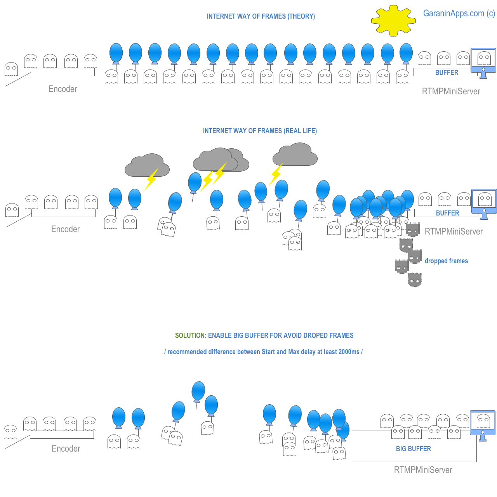

**About Start and Max delay**
==

In theory frames should be going to RTMPMiniServer with constantly FPS as encoder sent, for example 25 fps. But in real life it’s not true (see image).

We add “Buffer” to smooth out the situation. Buffer is place where frames will be ordering before go to NDI output.

**Start delay** – how many frames should be waited before start NDI output.
If you setup it to 1000ms then it means 25 frames for 25fps or 30 frames for 30fps.

**Max. delay** – how many frames allows be in buffer. You can setup to 2000ms. So it means buffer can accommodate 50 frames for 25 fps stream.
If 51 frames will be arrive at moment (because network may be “jump”) then frame number 51 will be dropped.

Common recommendation: for unstable network use Start Buffer at least 1000ms and use Max.Buffer as “Start + 2000ms” (at least).
