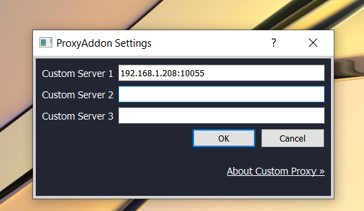

**Custom Proxy Server**
==

We provide special docker-image. So you can do this steps:

1. Rent any Linux server (vps or dedicated). Bandwidth and location make sense. We recommended use Ubuntu or Centos.
2. Install Docker to host.
3. Run docker command: `docker pull garaninapps/rms_proxy`

`docker run -p=8080:8080 -p=8082:8082 -p=10000-10100:10000-10100 --env ALLOW_PORT_STICK=ON  --restart=always -d garaninapps/rms_proxy`

Notes:

* This command use pool of 10000 – 10100 ports and allow “sticked” port (see below)
* We recommended use your owned proxy servers because our servers is public and may be under hight load.
* Many hosting platforms allow pay on hour of usage, so you can hibernate your server and use only for events.

**About “sticked” port**

Since version 1.7.2 you can fix used port. For example you can use 10055 always. Just type your custom server as IP:10055

