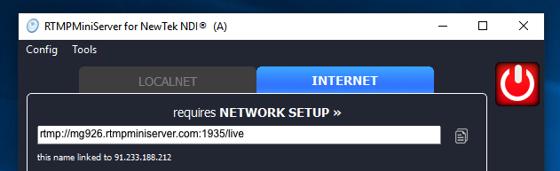
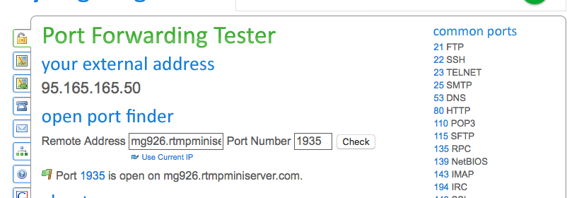
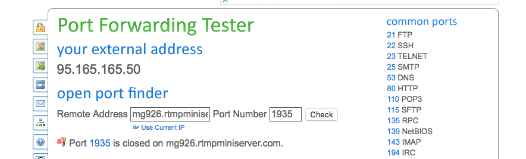

**Direct connection: easy way for check**
==

So you did this [instruction](http://help.garaninapps.com/2019/05/01/connection-from-internet/) and now you would like check this.

**Step 1**

Run RTMPMiniServer and press Start

**Step 2**

Go to this site https://www.yougetsignal.com/tools/open-ports/
and type your address and port.
In my case it’s *mg926.rtmpminiserver.com* and **1935**
And press Check.

successful check.

If you have closed port or RTMPMiniServer stopped then you got fail:

check failed (because I stopped RTMPMiniServer)
