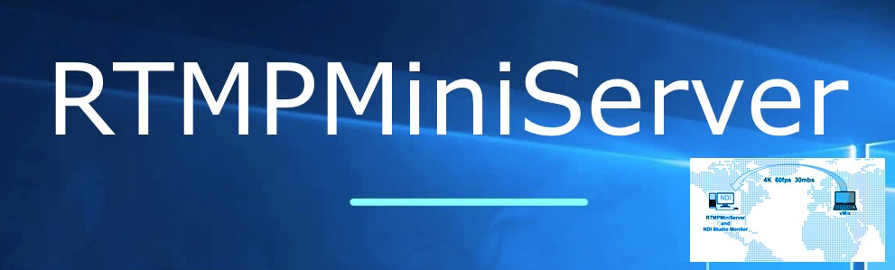
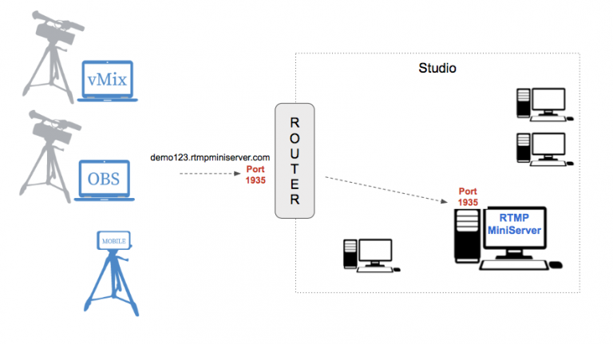
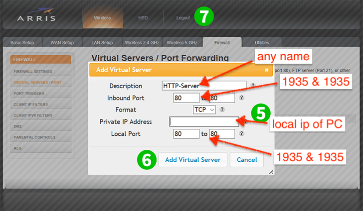
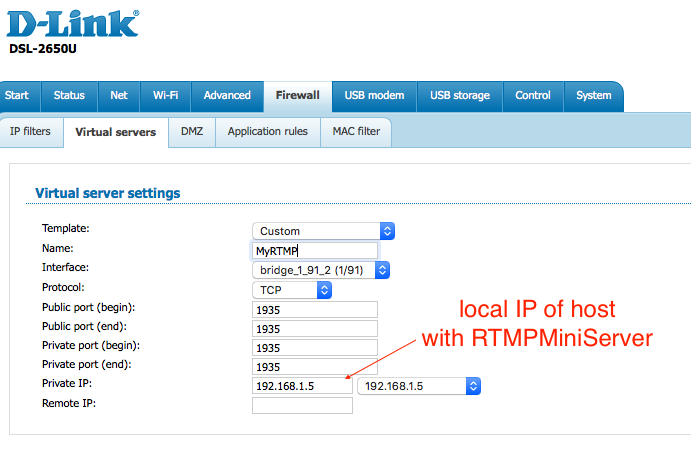

**Direct connection from Internet**
===

If you have not public IP or have not ability for port-forwarding then please use other way – [ProxyAddon](http://help.garaninapps.com/2019/08/26/proxy-add-on/)

for accept direct connections from INTERNET (for example from stadium or other country) please check this points:

1. **Your “Studio” has public IP.**
*We provide dynamic DNS name like [“demo123.rtmpminiserver.com”](http://demo123.rtmpminiserver.com/) . It will be auto linked to this IP.*

2. **Router has configuration**:
all incoming connections from Internet to port 1935 of router transfer to PC with RTMPMiniServer 
without this rule your router doesn’t known how handle traffic to 1935 port. **This called “”Port Forwarding” or “”Virtual Servers”.
It’s easy and we provide simple instructions for few routers**

router should known how to handle incoming connections
##
**How to check**

please read [this post](http://help.garaninapps.com/2019/06/03/connection-from-internet-2-easy-way-for-check/) about checking.
##
**Router example**

**Example A**: you install RTMPMiniServer on PC with local ip 192.168.1.5 and setup Listen port as 1935. 
So you need setup port forwarding for router: inbound connection to 1935 port send to 192.168.1.5:1935.

**Example B**: you install RTMPMiniServer on PC with local ip 192.168.1.5 and setup Listen port as 7777.
So you need setup port forwarding for router: inbound connection to 1935 port send to 192.168.1.5:7777.

Many routers called this feature as “Port Forwarding” or “Virtual Servers”.

Examples:

for ARRIS router

for D-Link router
