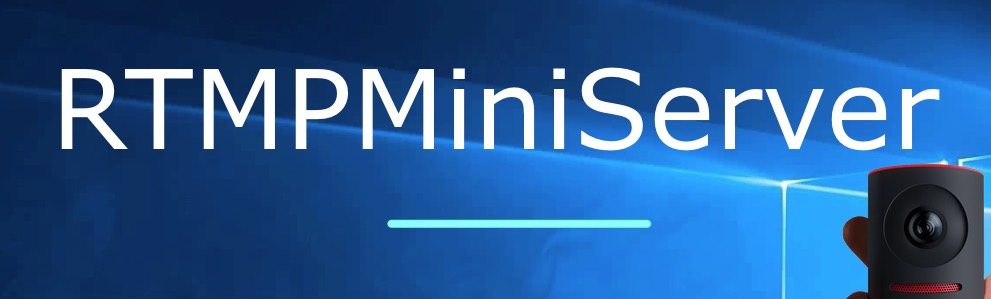
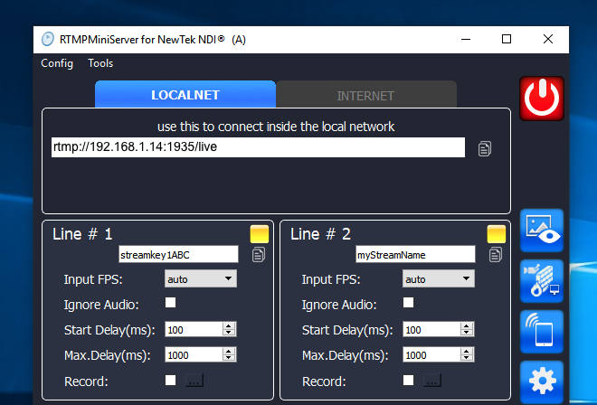
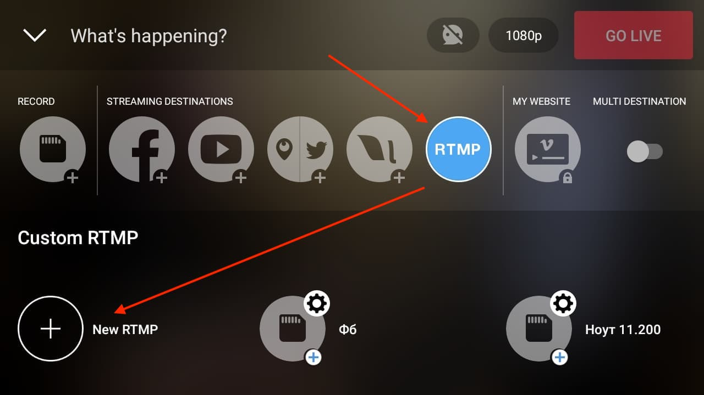
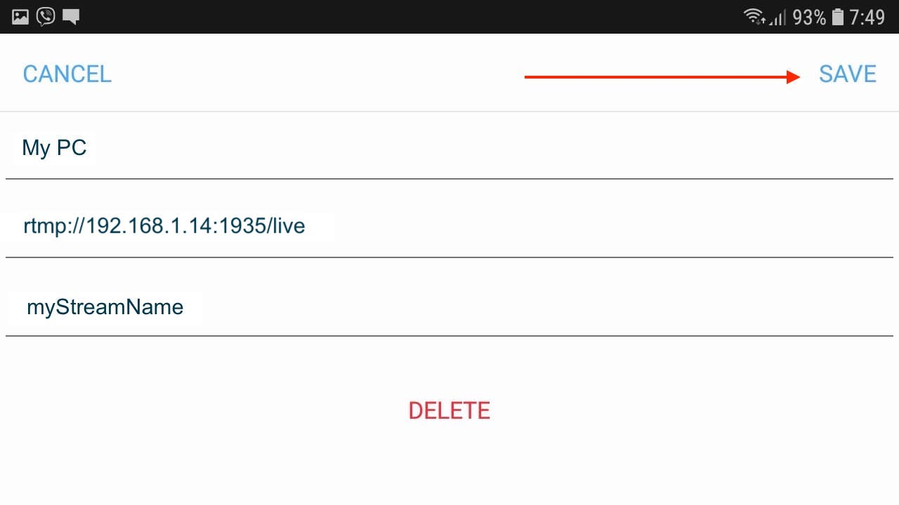
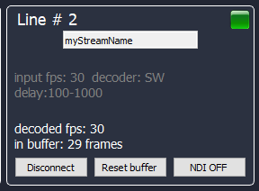

**How to connect Mevo**
==

**Step 1:** run RTMPMiniServer

Enter any stream name for any line and press Start

For example: I entered *myStreamName* for Line #2

**Step 2:** go to phone and run Mevo app

Select Custom RTMP and press “New RTMP”.

**Step 3:** fill out the form and press SAVE.

params see in Step 1. 

BE AWARE: use local-ip based address for connect in same network.

##
**IT’S ALL.**

press GO LIVE

and add NDI Source called “MiniServer – Line 2” to vMix or OBS.

ACTIVE STATE 

GREEN ICON SIGNALS ABOUT CONNECTION

##

See our test Mevo and vMix by RTMPMiniServer:

https://youtu.be/SJLRkcd044w
