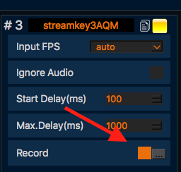
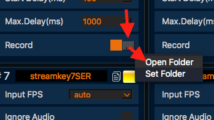

**How to make dump of stream for support**
==

Sometimes we can request you make dump of stream for analyse and solve an issue.

Steps:

1. Check-on “Record” option (so server will be record incoming stream).

2. Start stream. Please use content where we can see the issue. For example: if you have audio sync issue then please stream speaker or special video.

3. After 1-2 mins stop stream.

4. Open folder with records and send recorded file called Line_*****.flv to our support email Support@GaraninApps.com

