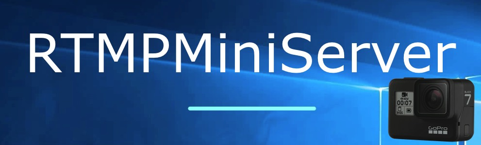
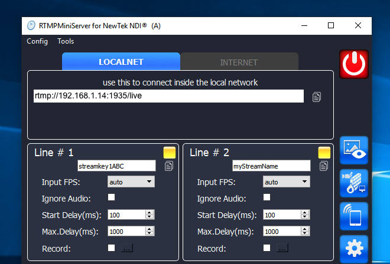
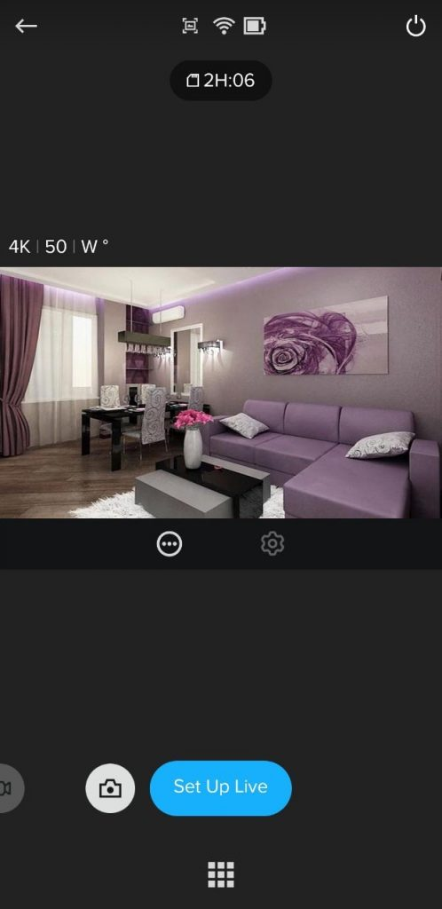
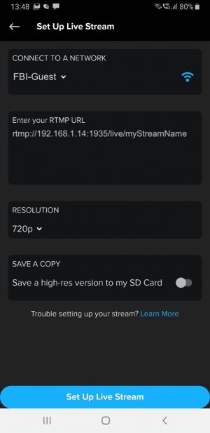
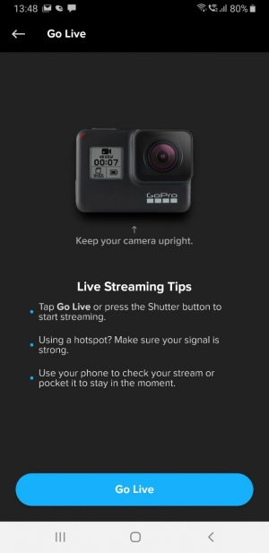

**How to use GoPro7**
==

It’s how to connect GoPro7 to RTMPMiniServer in same network. So you can use GoPro7 with vMix, OBS and other NDI apps.

Notes: for connection through internet you need do [additional preparation on router](http://help.garaninapps.com/2019/05/01/connection-from-internet/).
##

**Step 1:** run RTMPMiniServer

Enter any stream name for any line and press Start.

For example: I entered myStreamName for Line #2

**Step 2:** go to phone and run GoPro app.

Select “Set Up Live””.

**Step 3:** select Wifi, resolution and type RTMP URL.

RTMP URL is full url from “Step 1” include stream name.

For my case it’s : rtmp://192.168.1.14:1935/live/myStreamName

**Step 4:** press Set Up Live Stream and you got new screen. Press “Go Live”.

Now I can open any NDI consumer (vMix, OBS etc) and use NDI feed.

**It’s all.**
