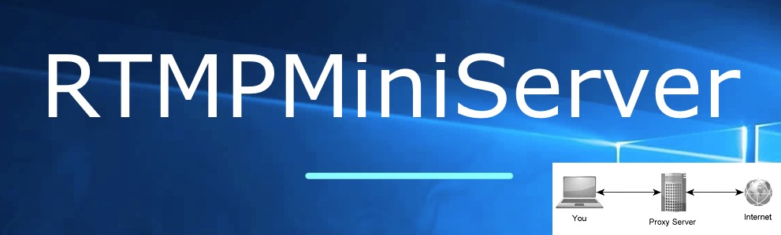
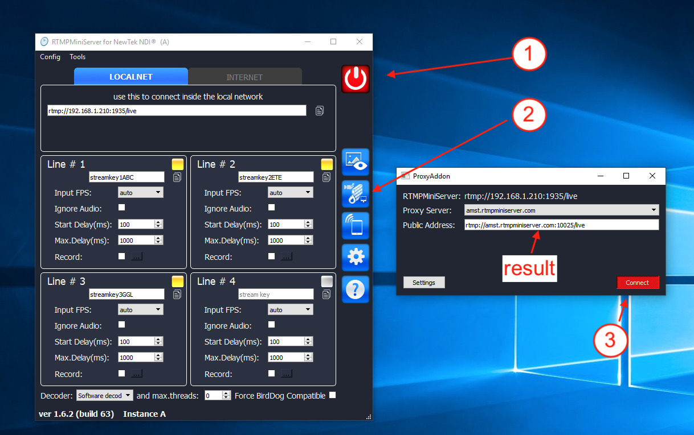
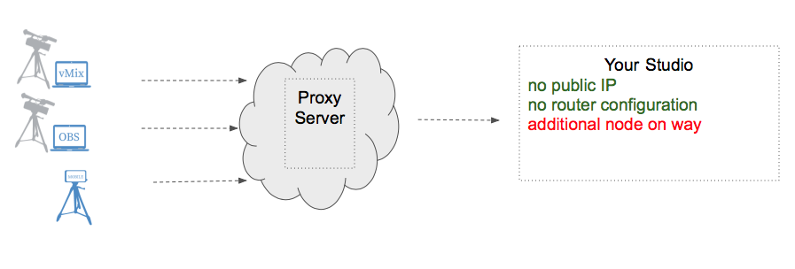

**Proxy Addon**
==

ProxyAddon is easy way for accept signal in Studio from Location.
It does not require dedicated IP and port-forwarding manipulation.
Just click and use.

1. Run RTMPMiniServer and press START
2. Click ProxyAddon icon. It opens “Proxy Addon” window.
3. Press “Connect” for get public address. Use this as RTMP URL.

So for this image full stream address for Line #1 is:

`rtmp://amst.rtmpminiserver.com:10025/live/streamkey1ABC`

NOTES: ProxyAddon is easy way, but usage of dedicated IP is still preferred way for big studio and heavy traffic.
##

**FAQ**

**What is cons and pros of usage proxy addon?**

*Cons – you don’t need dedicated IP and port-forwarding setup. It’s perfect for using for mobile studios.
Pros – this workflow has 3 participants: Publisher–> Proxy-server –> Studio
instead 2 participants for direct connection (Publisher–>Studio)*

Cons and Pros

**Where are located proxy servers ?**

Now we are providing few public proxy nodes in Europe.

**Can I deploy my proxy server?**

Yes, you can deploy proxy node on your server and it’s very easy.
For example you can rent VPS from DigitalOcean or Scaleway or AWS and deploy proxy node. Many cloud providers allow hour-rate so you can turn on server only for event. See this [guide](http://help.garaninapps.com/2019/09/09/custom-proxy-server/).

**Our Studio in USA has dedicated IP and we happy with RTMPMiniServer. What is advantage of proxy addon we can get?**

You can get advantage if your publisher in other country. Proxy node allows solve the “first mile” issue. More detailed explanation see [here](https://medium.com/garaninapps/proxy-add-on-for-rtmpminiserver-85a23edaffce)
