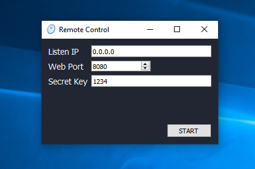

**Remote Control**
==

// this feature available in version 1.6 BETA

Go to top menu –> Tools –> Remote Control. It opens “Remote Control” window.

Remote Control starts lite web-server and you can use browser for monitoring RTMPMiniServer.

**Listen IP**: tells the server to listen for incoming connections on this IP address.  If value is 0.0.0.0, the server will listen on all network interfaces.
For example: If value is 127.0.0.1 then the server allows connection from localhost only.

**Web Port**: port for listening.

**Secret Key**: it’s like password. Use any alpha-numeric value.
##

**Advanced usage: API**

Remote Control server provides simple web API. So you can read info.

`NOTES: example of usage see at INSTALLED_FOLDER/WEB/code.js`

Common params:

any requests should includes params “tick” and “sign”.

**tick**: any integer value. Should be growth: next request value greater previous value. You can use timestamp for this.

**sign**: md5 hash from string *“tick:secret_key“*

`NOTES: if secret key is empty then you can omit tick and sign params, but be aware – it’s not good practice.`

**GET /api/v1/read**

returns info about lines as JSON:

[ line_info, line_info….]

where line_info is

{

line – int , line number

state – string , NOTACTIVE|DISABLE|WAIT|CONNECTED

decode_fps – int,

in_buffer – int,

bitrate – int,

decoder_type – string, HW|SW,

source_fps – int,

start_buffer – int,

max_buffer – int,

frame_width – int,

frame_height – int,

ignore_audio – bool,

record – bool

}

**POST /api/v1/_LINE_NUM_/disconnect**

example: /api/v1/1/disconnect 

call disconnect for line with _LINE_NUM_.
