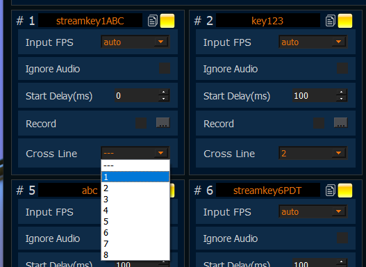
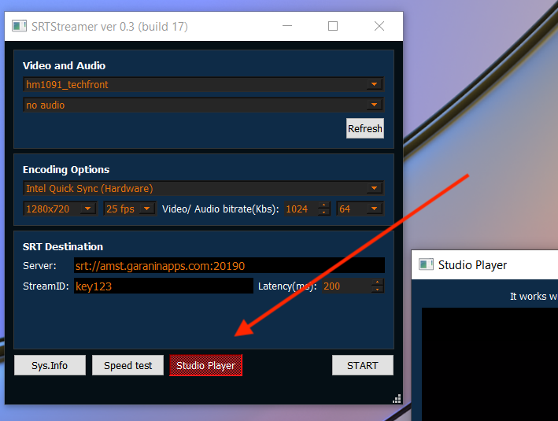
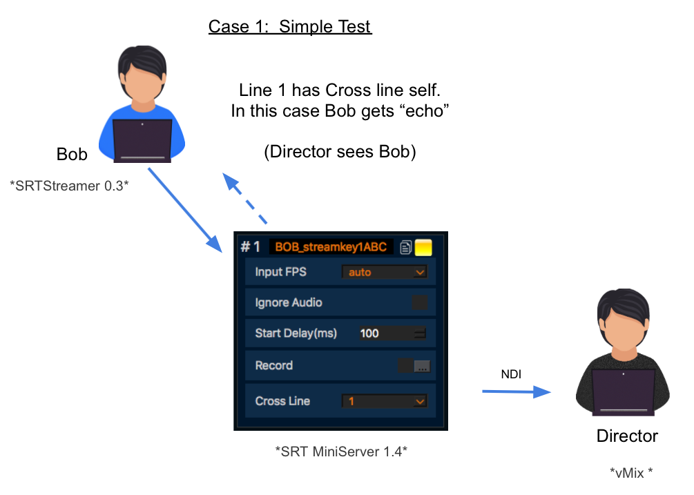
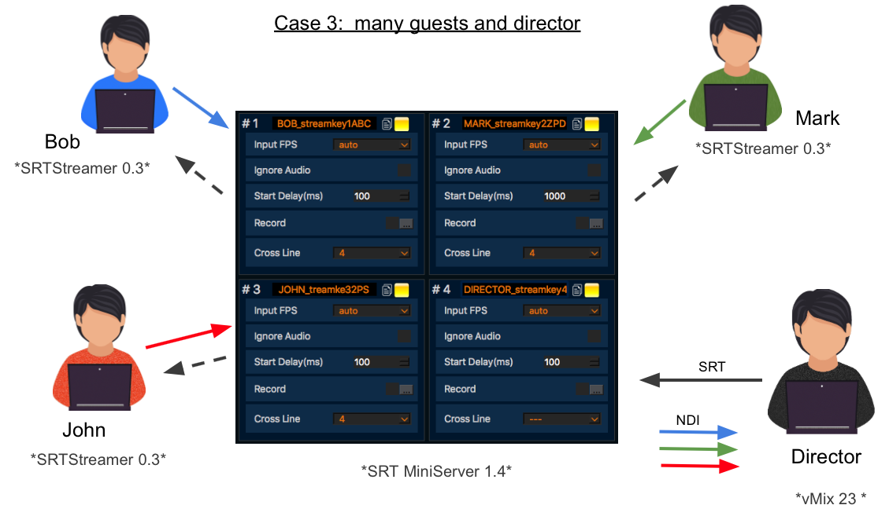

**SRT: Cross Line. Power Feature for Remote Production.**
==

For each Lines inside SRTMiniServer you can setup “Cross Line”. 

For example: for Line #1 I selected Line #3 as “Cross Line”. So signal from Line#3 will be re-stream to encoder connected to Line #1.

For SRT Streamer we added button “Studio Player” for view feedback signal.

Common cases.

