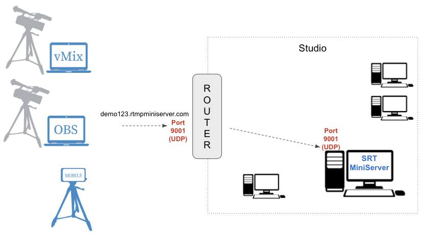

**SRT: direct connection from Internet**
==
*If you have not public IP or have not ability for port-forwarding then please use other way* – [ProxyAddon](http://help.garaninapps.com/2020/02/12/srt-proxy-addon/)

for accept direct connections from INTERNET (for example from stadium or other country) please check this points:

1. **Your “Studio” has public IP.**
 *We provide dynamic DNS name like* “[demo123.rtmpminiserver.com](http://demo123.rtmpminiserver.com/)” . *It will be auto linked to this IP*.

2. **Router has configuration**: all incoming connections from Internet to port 9001 of router transfer to PC with SRT MiniServer. 
*Without this rule your router doesn’t known how handle **UDP** traffic to 9001 port. **This called “”Port Forwarding” or “”Virtual Servers”.***

router should known how to handle incoming connections
##
**Examples**

**Example A:** you install SRT MiniServer on PC with local ip 192.168.1.5 and setup Listen port as 9001. 
So you need setup port forwarding for router: inbound UDP connection to 9001 port send to 192.168.1.5:9001.

**Example B:** you install SRT MiniServer on PC with local ip 192.168.1.5 and setup Listen port as 7777.
So you need setup port forwarding for router: inbound UDP connection to 1935 port send to 192.168.1.5:7777.

Many routers called this feature as “Port Forwarding” or “Virtual Servers”.
