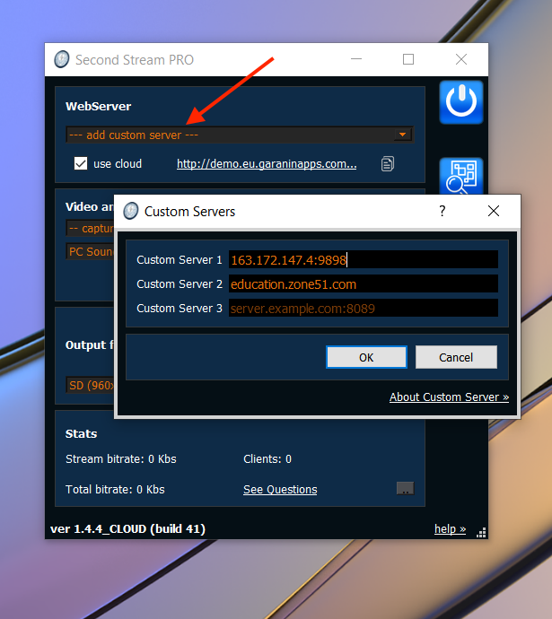

**SecondStream: Custom Server**
==

We provide special docker-image. So you can do this steps:

1. Rent any Linux server (vps or dedicated). Bandwidth and location make sense. We recommended use Ubuntu or Centos.
2. Install Docker to host.
3. Download our server and Run (see below)
##

**Download and Run**

wget [http://downloads.garaninapps.com/ss_server.tar.gz](http://downloads.garaninapps.com/ss_server.tar.gz)

tar -xzf ss_server.tar.gz

cd FILES

./start_server.sh 80
##
**NOTES**: you can use other port instead 80, for example:

./start_server.sh 9898

After you can add your server to the app:

