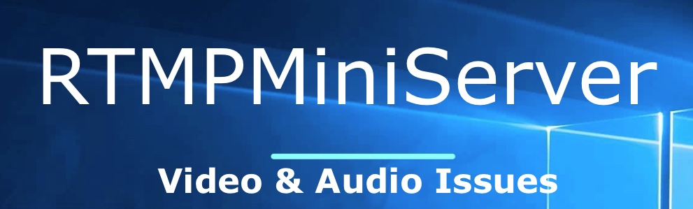
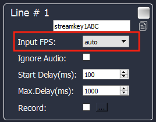
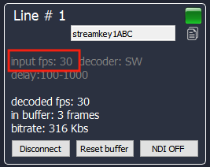
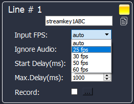
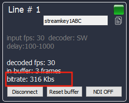
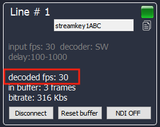
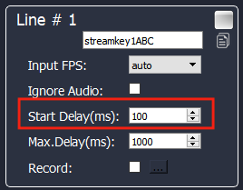

**Video & Audio Issues**
===
Sometimes new clients wrote
1) I seem to be having some troubles with audio-video sync
2) Audio is bad
3) Video is not smoothly

Let me explain reasons and solutions.
##
**Reason 1: wrong FPS detection**

By default the app uses “auto” for “Input FPS”. This means the app tries auto detect fps for incoming streaming. If the app do this incorrect then result will be wrong.

setup “auto” FPS detection

Please check “input fps” info during process. It should be same as original FPS.

detected “input fps”

**SOLUTION**: if you see incorrect detection (for example 30 instead 25 ) then please setup “Input FPS” manually to correct value.

manually setup
##
**Reason 2: heavy stream for your connection**

For example: encoder sent 20Mbs stream but Studio has 10Mbs connection only.

You can see real incoming bandwidth in “bitrate” value during processing.

input bitrate value

If “bitrate” value less than it should be (for example 316 Kbs for 5Mbs of original stream) then it means your connection not enough for incoming stream.

**SOLUTION**: change bitrate setup on encoder-side or call to ISP
##
**Reason 3: unstable connection**

Sometimes connection speed can be jumped. Please check “decoded fps”. For good streaming “decoded fps” should be about “input fps”.
For example: if “input fps” is 30fps then “decoded fps” can be jump between 28-32.

If you see “decoded fps” jumps very hard then it means connection is unstable.

**SOLUTION**: increase Start Delay.

“Start Delay” fills out special buffer before star NDI output. This buffer allows smooth out jumping incoming feed.

Note about “Max Delay”: you can setup it as “Start delay” + 1000.

