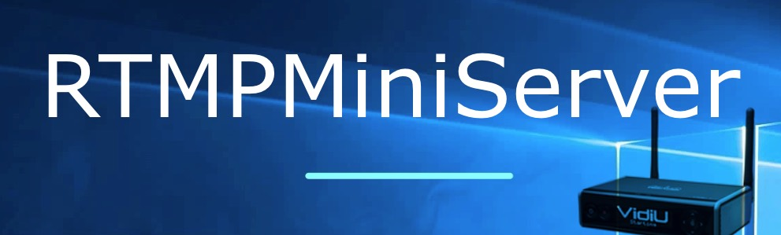
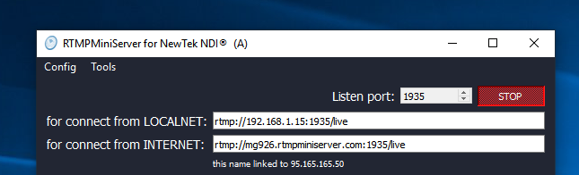

**VidiU Teradek: connection issue**
==

**NOTE:** before please check RTMPMiniServer for accept connection from Internet (see [here](http://help.garaninapps.com/2019/06/03/connection-from-internet-2-easy-way-for-check/)).
##

**Issue**

User uses VidiU encoder and RTMPMiniServer located on Office A. All works fine through Internet.

User move RTMPMiniServer to other Office B(other public IP) and do [setup](http://help.garaninapps.com/2019/05/01/connection-from-internet/).

Do check (as wrote [here](http://help.garaninapps.com/2019/06/03/connection-from-internet-2-easy-way-for-check/)) – all is fine.

BUT VidiU encoder can’t connect to RTMPMiniServer.

Why ?….

If shortly: it seems few models VidiU does not correct work with dynamic dns.
##

**Solution**

If you have mobile studio (PC with RTMPMiniServer changes public IP) and you use encoders from Teradek then my recommendation is use IP-based address instead “[rtmpminiserver.com](http://rtmpminiserver.com/)”-based.

For example:

I can use “rtmp://[mg926.rtmpminiserrver.com](http://mg926.rtmpminiserrver.com/):1935/live” but for VidiU
very recommended use “rtmp://95.165.165.50:1935/live”. Of course after change public IP you need enter new ip-based url to VidiU.
##

**Explanation**

In most cases I can use dynamic DNS-address [mg926.rtmpminiserrver.com](http://mg926.rtmpminiserrver.com/)

This address always linked to my current(!) public IP.

For example in office it will be linked to IP-1 , in home it will be linked to IP-2.

**What is problem with VidiU?**

VidiU remembers first linked IP and does not re-read new info. So it always thinks “[mg926.rtmpminiserver.com](http://mg926.rtmpminiserver.com/) linked to IP-1”.

**NOTE:** of course I reported about it to Teradek
