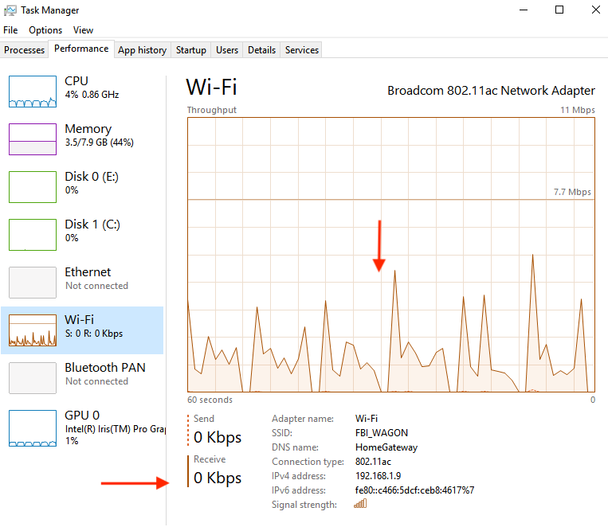

**Windows WiFi issue**
==

I got feedback about unstable video feed when RTMPMiniServer (Windows version) connected by WiFi. Of course I recommend use cable for connect studio’s PC to router but sometimes it’s impossible.

So I did test in my local Wifi: send video feed from one host to other PC (with RTMPMiniServer). I used Wifi 5Ghz and lite video feed – bitrate ~1.2Mbs.
And I got the PROBLEM: my resulted feed breaks very often.

I was confused…. I opened Task Manager and saw this image for WiFi:

Wifi Spikes
##
**Wifi Spikes**

I typed “windows 10 spikes wifi” to Google and it shows many pages about the issue. Many users reported about ping spikes like this:

Ping shows the issue.
How to check your Wifi for this issue? Just open Command Prompt and run:

`ping www.google.com -t`

If you see periodically unstable timeouts like image above then your WiFi not good for streaming.

How to fix it? Main ideas for fix it: disabling Windows Updates uploading to other PC, or disabling One Drive.

You can read this reports for more details:

https://answers.microsoft.com/en-us/windows/forum/windows_10-networking/permanent-fix-for-wifi-ping-spikes/0f16392a-6c2b-41e6-ac1c-5db88ace40a6

https://hitech-us.com/articles/entry/292/Ping-spikes-on-Wi-Fi-every-10-seconds-Solved
##

**Solution**

I did this steps for fix it on my PC:

1. Go to Windows Settings –> Update & Security

2.  Check updates and install it.

3. Move to “Delivery Optimisation” and disable “Allow downloads from other PCs”.

4. Restart Windows.
##

**Result**

I repeat my test and got perfect result without spikes:

