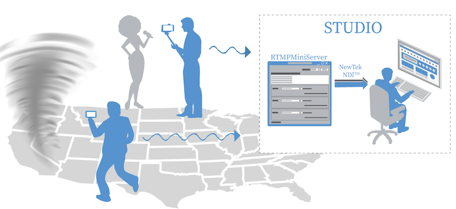
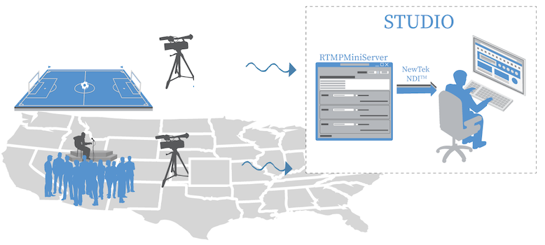
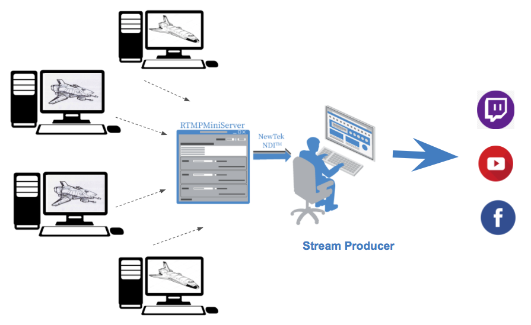

**Cases of using RTMPMiniServer**
==

Periodically we are going to consider some cases of usage of RTMPMiniServer. Some of the cases were sent by our users. In this longread we would like to review three cases of usage of the program, which are connected with journalism and game streaming.
##

**Distant reporters**

The first case is typical for low-budget studios including school and small regional studios. Our program lets you create a quite cheap web of mobile reporters who need only in a smartphone in order to transmit video data. Let’s review the case in a certain example.

Imagine what you have to make a report from another spot of a town. Previously it claimed a team of reporters and technicians with plenty of equipment and expensive powerful cameras. Nowadays modern iPhones have enough power and decent cameras for making high-quality videos. So anyone who has a modern smartphone can become your mobile reporter.

The scheme looks so: LarixBroadcaster program is set on any iOs or Android. This is RTMP-encoder apps which were set in the studio. As the modern nets of communication provide enough admissing ability for RTMP-flow, you can easily stream from the place of the event to the studio using LarixBroadcaster. We have optimized the latency, so you get your report almost in real time. Also, naturally, because of modern nets of communication, your reporter can be anywhere if there is an Internet connection. The signal will come directly in your server, so you will be provided with breaking news. Thus this is a cheap way for possession of an army of “mobile” reporters.

*Mobile reporters in an any spot of the world*

Moreover, this case can find its use in exhibitions, when you want to make a direct transmission and show what is going on in different parts. It is pretty difficult to lay wires, which are used for high-quality signal transmission, in various art-places. However, if you use our program, you will be able to make live streaming. Your reporters will make standups and reviews on exhibits. Data will be transmitted on vMix and you will process it and make live streaming.

*Mobile reports on an exhibition*

##

**Distant reporters for professional studios**

If you want to transmit video data from a professional camera, you should use a portable video encoder, such as Cerevo LiveShell.2. The device which allows making a RTMP-stream can be set on any type of camera. Video data is sent to the RTMPminiServer where they are going to be processed.

This case can find wide and important use. For example, it can be a large-scale sports event or a concert because it is rather difficult to lay wires where. Potable video encoders allow transmitting high-quality videos using Wi-Fi.

*Cerevo LiveShell*

**Game streaming**

As it was said earlier, users frequently send us feedbacks and describe different cases of using the program. The last case which is going to be considered was sent by a user. It is devoted to game streaming, which is popular nowadays.

There are gamers who do not want to check in various live streaming video platforms (e.g. Twitch) and communicate with other users. They are interested in the game process itself. They unite in game communities, but such groups do not receive enough monetization because gamers are not interested in self-advancement. Nevertheless, they can employ a peculiar director-producer, a person who is interested in providing the channel. His task is to receive flows from the gamers, their processing in real-time mode (comments, mixing) and the streaming on such platforms as YouTube or Twitch.

Technically that looks so:

1. Each gamer sets free OBS (or StreamLabs) and stream on the producer’s computer.

2. The producer’s computer with RTMPMiniServer, which was set earlier, turns streams from the gamers into NDI format and the producer is able to work with them using vMix or OBS for the next streaming.

Finally, the stream turns out to be more interesting because it shows a group game and such approach attracts viewers.
