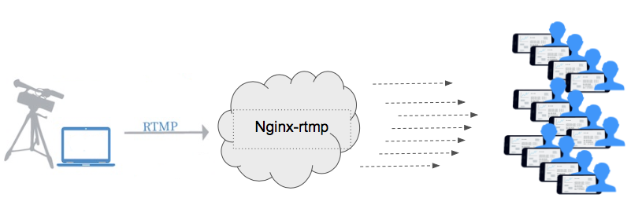

**How RTMPMiniServer differs from other servers**
==

I would like to briefly clarify the difference between RTMPMiniServer and other servers, such as Nginx-rtmp, Monaserver, Wowza, etc. And also explain how low-latency is achieved in RTMPMiniServer.
##

**The difference of the main task**

RTMPMiniServer was created for a completely different task rather than ordinary servers.
The main task of Nginx-rtmp (and others): to receive the stream and distribute it to a large number of users via the Internet.

*main task for Nginx-rtmp (Wowza, Monaserver etc)*

The main task of RTMPMiniServer: to receive the stream in the studio and send it for further production to the local network as quickly as possible.

*main task for RTMPMiniServer*

`The “main task” strongly dictates the internal architecture of the program and the points that need to be optimized (sometimes to the detriment of others)`
##

**Achieving LowLatency**

Sometimes, the task for which RTMPMiniServer was created is solved using Nginx-rtmp. At the same time, there is a latency of 3 seconds or more even on the local network, and it is impossible to decrease it.
And that’s why:

In this scheme, there is a “slow” rtmp-pull stage and h264 decoding is performed by vMix.

This is how it works when using RTMPMiniServer:

The decoding is done on RTMPMiniServer, and a low-latency NDI ready-made picture is sent to vMix.
Due to this scheme, RTMPMiniServer allows you to receive a signal to production quickly. Even when transmitting across the ocean, 4K @ 60fps delay was about 1 second.
##

**Server Deployment Speed**

Often, at the stage of preparing for live event, it is necessary to quickly check the general signal reception scheme from different locations, drones, mobile cameras etc.

RTMPMiniServer was created specifically for such a deployment, without the need of looking through / reading / googling instructions for a long time and editing text config files.

RTMPMiniServer is a standard Windows (and macOS) application, with the most simplified interface. It takes just a few minutes to start using it. In addition, the new ProxyAddon mode allows you to receive a signal in the studio even without a dedicated IP and without configuring your router.
