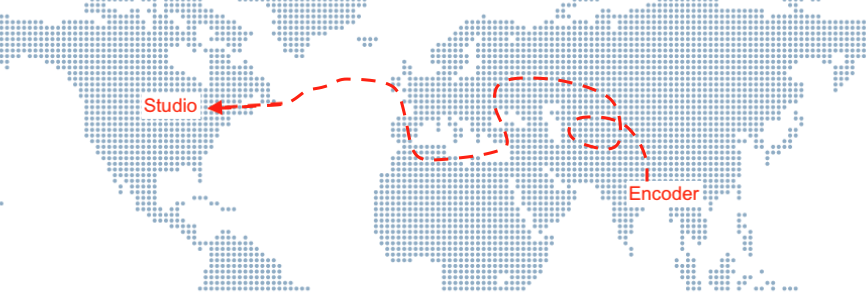
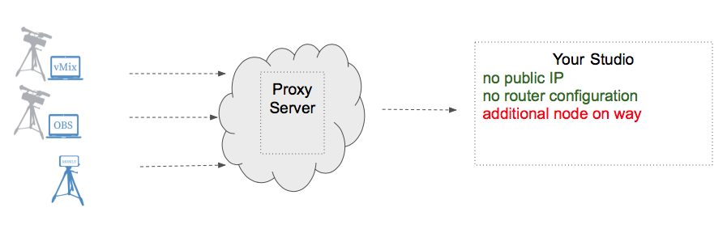
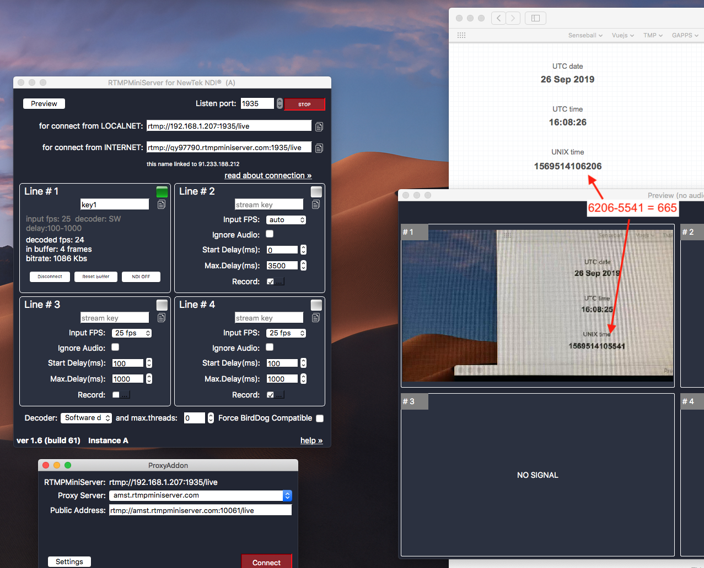
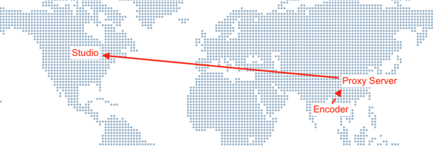

**Proxy add-on for RTMPMiniServer**
==

Like most servers, the RTMPMiniServer requires a dedicated IP address. It is a significant thing, because this way, encoders with locations, such as vMix or Teradek VidiU, can connect to the RTMPMiniServer in the studio via the Internet. As a rule, most studios are equipped with cable Internet, and providers can give a dedicated IP without any difficulties. The main problem arises, if the studio, especially the mobile one, is connected to the Internet via a 4G / LTE connection. In this case, it is practically impossible to get a dedicated IP.

That is why, to the new RTMPMiniServer 1.6 release, we have added a proxy mode that allows you to send a signal to the studio without a dedicated IP address, and without manipulations with the studio router.

In this mode, all the traffic goes through a special server (Proxy Server), located on the Internet. We provide several of these servers for all our clients, but if you wish, you can also use your own one (the instructions are attached below).

##

**ADVANTAGES:**

*- no need to have a dedicated IP*

*- no need to configure your studio router*

*- easy to use*

*- the proxy server can be positioned closer to the location (see below about the “First mile” problem)*
##

**DISADVANTAGES:**

*- on the path “Encoder → Studio” the ProxyServer appears, and all the traffic goes through it.*
##

**About Latency**

We did simple test: sent feed to ourselves.

So way : *Office(iPhone+LarixBroadcaster)--->ProxyServer(EU)-->Office(RTMPMiniServer)* 

And got under-second latency (~700ms).

##

**“First Mile” Problem**

Let’s say your studio has the wired Internet, and a dedicated IP. Can you still use the proxy mode somehow? Yes, in some cases. There are situations, when you need to put an unstable signal to a good Internet channel as quickly as possible, and the proxy server will help you with this.

Consider the case, when your studio is in America, and you need to get a signal from operators, located in Asia (for example, there is a business training). The operators can only use the mobile Internet.

There are two variants.

***Variant one (standard):*** your operators send the signal directly to the studio. But such a long TCP connection over indistinct routes can be very unstable, especially when encoders use the mobile Internet.

*direct connection may be unstable on long distance*

***Variant two (proxy):*** your operators send a signal to the nearest proxy server, which is located on a platform with a good international Internet channel.

*proxy-mode allows add stability for long distance*

In this way, instead of one long connection, there are 2 small, and the segment of unstable communication is reduced. So, we get a more stable connection.

You can always rent a server in the desired region, for example, in the same Amazon AWS. Moreover, many hosting providers allow hourly payment for the server, so, you can once get a proxy server and use it only when necessary.
##

**FAQ**

**Where are located proxy servers ?**

Now we are providing few public proxy nodes in Europe.

**Can I deploy my proxy server?**

Yes, you can deploy proxy node on your server and it’s very easy.
For example you can rent VPS from DigitalOcean or Scaleway or AWS and deploy proxy node. Many cloud providers allow hour-rate so you can turn on server only for event. See this [guide](http://help.garaninapps.com/2019/09/09/custom-proxy-server/).
