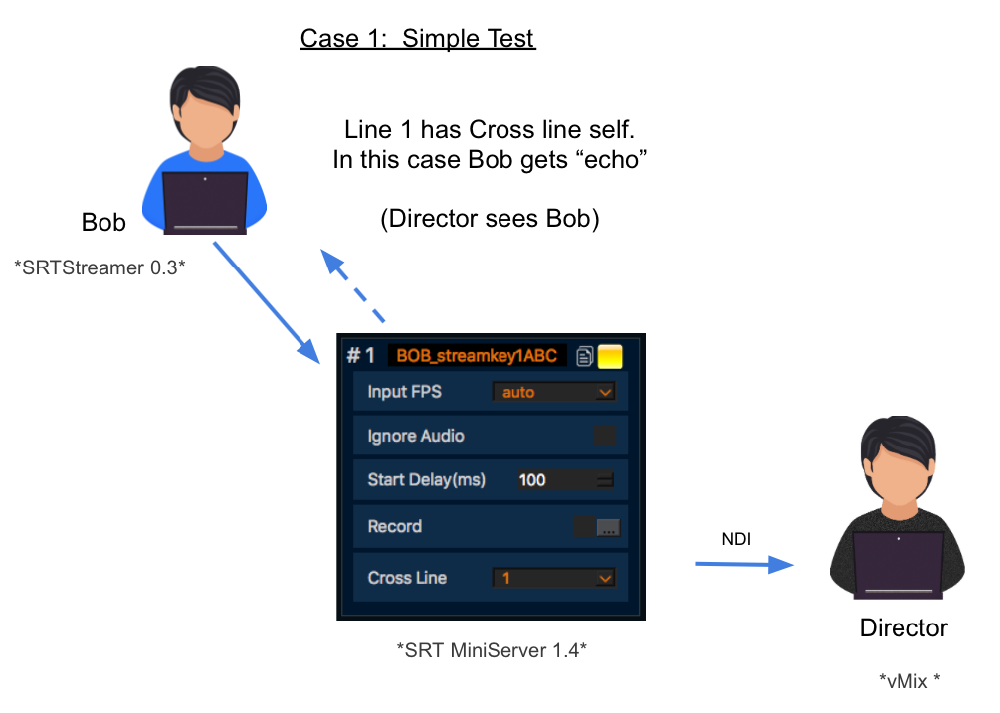

**SRT: Cross Line Feature**
==

We have released new versions of our SRT products: SRTMiniServer 1.4 and SRTStreamer 0.3
Main new feature called "Cross Line". It allows feedback signal from Studio to Locations.

For each Lines inside SRTMiniServer you can setup "Cross Line".  For example: for Line #1 I selected Line #3 as "Cross Line". So signal from Line #3 will be re-stream to encoder connected to Line #1.

For SRT Streamer we added button "Studio Player" for view feedback signal.

Common cases.

