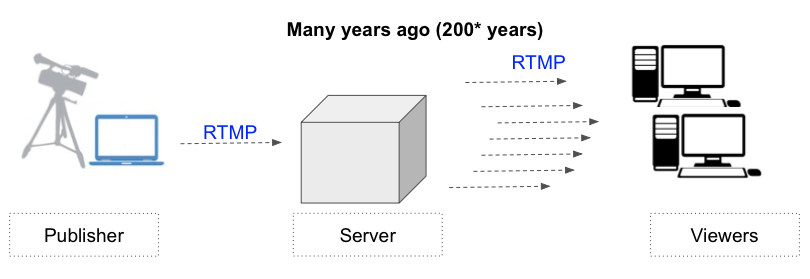
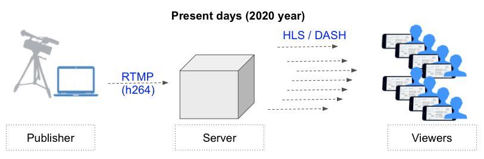
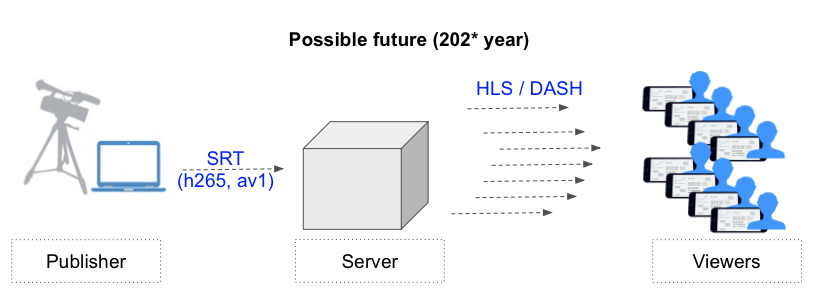

**SRT. Short review.**
==

I’ll try to briefly tell you what the SRT protocol is,why is it needed,and how soon he will “kill” RTMP
##

**RTMP: Past & Present**

As you know,there are three sides involved in the streaming process: Publisher, Server, and Viewers. This defines two segments,in which RTMP prevailed many years ago. Largely, due to popularity of Flash technology on desktops.

Some time later, when the refusal of Flash occured,and content consumption has shifted towards mobile, the situation has changed. Nowadays, if we consider the segment from the Server to the Viewer, tnen we can definitely say - RTMP is no longer in this segment. It was replaced by the HLS protocol,the brainchild of Apple,and a number of less common protocols,but with the same general idea: make small files (3-10 seconds) and send them to the viewer.

But in the Publisher → Server segment, the RTMP protocol still does not give up its position and is a monopolist. If you want to stream on Facebook, YouTube or Twitch, you should use RTMP. Because of this manufacturers of streaming software and hardware are also forced to support RTMP. Moreover, no one offered any other alternative.

NOTE: Some platforms may accept HLS / DASH. But this way is not very popular, because any “fragmented” protocol means a few seconds (!) of delay at the beginning of the stream.
##

**What does not suit RTMP?**

Adobe (owner of the RTMP protocol) stopped developing at that moment, when she buried Flash technology, but it was a long time ago. During this time, new codecs have appeared (h265, av1), and maybe more will come soon.I think you read codec reviews: h265 codec can give a 25-50% gain! Instead of 5Mbs, you just have an Internet channel of 3Mbs. This is great! Especially, if you need to transmit a signal through LTE.

Unfortunately, even using h265 inside RTMP will fail. Perhaps this is the main claim to RTMP - it is not suitable for new codecs.

NOTE: probably some will say: “hey, Chinese encoders write that they can h265 in RTMP!” They can, but this is some kind of non-official dialect of RTMP, and only a server from the same manufacturer can understand this feed.
##

**The early bird catches the worm**

Of course many teams  around the world made their own protocols. For example, it’s clear that LiveU has its own cool protocol, and even with the support of bonding. But it was Haivision who made a fuss, especially in the marketing part, and was the first to give the public a replacement for RTMP. The protocol was called SRT.
Competent Marketing, “open-source”, has done great job, and SRT is gaining popularity.
##

**SRT: Highlights**

Main points of SRT:

*SRT is the “codec agnostic” protocol. It does not matter to him what kind of codec is transmitted inside. Transfer h264, h265, av1 - no problem.*

*SRT is based on UDP (and RTMP is based on TCP), which allowed it to be “tuned” to current realities.*

*In SRT there are modes "can drops" (by default) and "no drops" (similar to TCP).*

*There is a firewall punching mode when there is no dedicated IP (see below).*

“Can drops” mode is by default, and is recommended for Live- streaming with a low delay. Of course SRT will try to forward the lost data within the allowed time interval.
By the way, this time is just regulated by the "Latency" parameter, which is present in many SRT encoders. By default, it costs 120ms. That is, if a data packet is lost, the system tries to send it again, and there’s 120ms for everything, after it is removed from processing.

In practice, with a large percentage of losses, it looks like artifacts in the picture. If we talk about the difference from RTMP in this matter, then in SRT you can setup the degree of compromise between “delivery speed” and “delivery quality”.

The "no drops" mode is intended in SRT for file transfer, where the loss of one byte can break the entire file. In streaming encoders you are unlikely to find such an option.

It is worth noting that the protocol is actively developing as part of open-source, and there are already discussions on how to add bonding to the protocol.
##

**Does SRT go through the firewall? It depends…**

For UDP (on which SRT is built) there is an old firewall punching method. It’s called “UDP hole punching”. It sounds like that: if two gnomes run to the wall dividing them, to one point, and at the same time (!) hit the same brick, then there is a chance to punch a hole. In SRT, it was called the “rendezvous mode”, and when setting it up, both participants need to know each other’s external IP (in fact, these are the coordinates of the “point” to be hit), and also coordinate the time of the “strike”.
It’s not easy for setup and does not give 100% guarantees. So “rendezvous mode” is not a silver bullet for firewall.
##

**Who will win?**

Technically, SRT certainly better than RTMP. The question is whether the SRT will go to the masses or whether it will remain a professional thing. 
Unfortunately the large platforms such as Facebook and YouTube did not announce about migration to SRT. 
Therefore, manufacturers of all kinds of mass stream devices such as action cameras, drones, portable streamers will produce RTMP devices, because users need to stream to these platforms. And they have no particular reason to move to SRT yet.

Time will tell...

***Welcome to SRT now !***

We provide two Windows-apps for easy enjoy to SRT.

Visit our [SRT-page](https://garaninapps.com/srt) for FREE download our apps!
