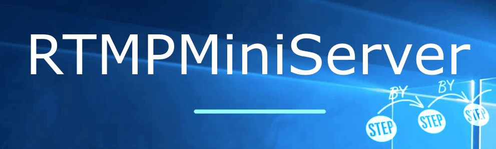

   **Step by Step**
===
It’s basic “how-to” when hosts in same local network.

So I would like build this workflow:

I used name “Server” PC and “Encoder” PC for my hosts.
##
   **“Server” PC**

**STEP 1**: Download [(link)](http://garaninapps.com/rtmpminiserver#downloads) and install the RTMPMiniServer. RUN IT.

**STEP 2**: press START

*Note: if you got error message “Port 1935 not available” then change port in Settings*

“yellow” icon means “wait” state (nobody connects to our server yet)

**STEP 3**: open Preview window

##
  **“Encoder” PC**

**STEP 4**: Open any RTMP-encoder. I use OBS on macOS: go to Settings —> Stream: select Custom service and type server and stream key.

**STEP 5**: press Start Streaming and your encoder starts send RTMP feed to RTMPMiniServer. So let’s go to “Server” PC for check result.

##

  **“Server” PC (check result)**

On “Server” PC I got this result:

  **Connect to NDI Workflow**

RTMPMiniServer converts incoming RTMP feed to NDI.
So just open any NDI software (vMix, OBS, Wirecast etc) and select NDI source called “MiniServer A- Line 1”.
For example I use “NDI Studio Monitor” from NewTek tools:

select “MiniServer A- Line 1”

