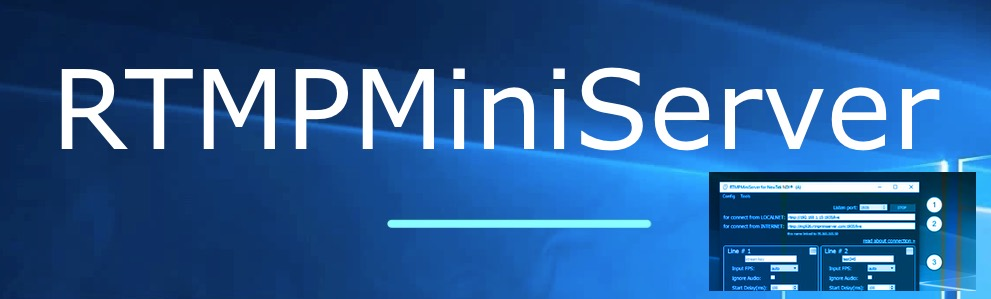
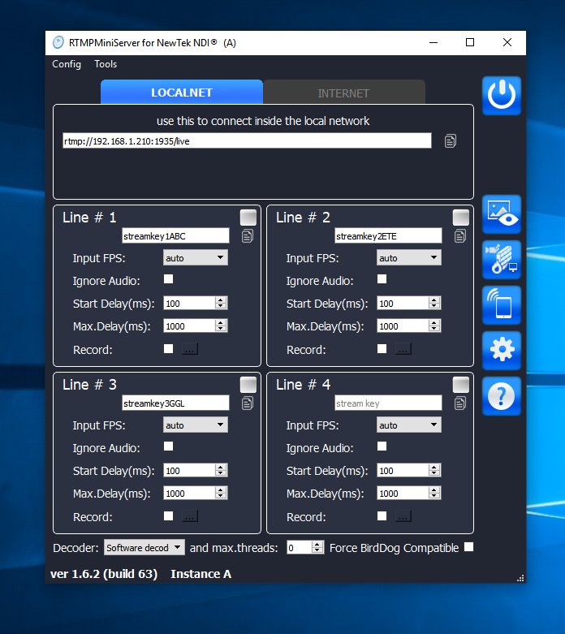
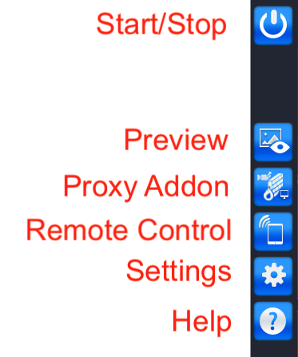
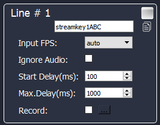
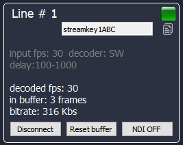
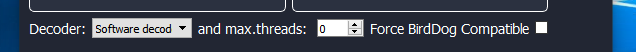
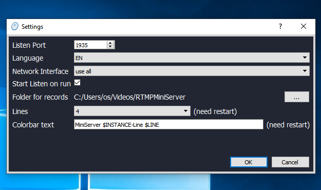

**User Interface Guide**
===

##
**Main buttons**

##
**Line Params**

Every Line has params:

***Stream Key*** – type any value (latin chars and digitals). Use it for encoders vMix, OBS etc. 

***Input FPS*** – this field is tip for server. You can use “auto” value. Also you can explicit setup this field if you known this info.

***Ignore Audio*** – use it if you don’t need audio from this source. It allows remove video-audio synchronisation process and save CPU and time. 

***Start Delay (ms)*** – use it for setup start delay. Recommended for use for unstable network – you can add start buffer for more smoothly output. For example if you setup 5 seconds then server starts NDI output only when will has video frames for 5 seconds.
This value should be less or equals to Max.Delay value.

***Max.Delay (ms)*** – use it for limit delay. All input frames go to special buffer and if buffer is full then frame will be dropped. For good network you can setup to 200ms for get real-time output. 
Be aware: delay feature uses buffer in RAM. For example FullHD/25fps will takes ~100Mb in memory for each 1second of delay. So delay for 10 sec requires 1Gb RAM.

***Record*** – use it for dump input feed. By default record saved to user-video folder. For change destination folder see [settings](http://help.garaninapps.com/2019/05/01/gui-schema/#settings).
##
**Processing Control**

When encoder (vMix, OBS etc) connects to the server then Line shows “green”-icon and info about processing (this values updates every 3 seconds) :

***decoded fps*** – shows info about decoded fps. For good network it should be same as input fps. For unstable network this value will be jumped. 

***in buffer*** – shows how many frames wait output in buffer. It depends on “Max.Delay” value.

***bitrate*** – shows info about input bitrate.

Buttons:

***Disconnect*** – use it for stop stream. After disconnect the server will ready accept new connection for this line.

***Reset buffer*** – use if for drop all frames from buffer. It allows got real-time.

***NDI OFF*** – use if for pause NDI processing.
##
**Additional params**

**Decoder** : this field allows change h264-decoder for handle input video stream.

*Software decoder*– good choice for bitrate under 10Mbs. It allows correct decode all h264 profiles.

Hardware decoder allows decrease CPU usage but more sensitive to h264 profiles. Use HW decoder for hight speed bitrate for get real profit. Be aware: some HW decoders allow only 1 or 2 decode process in same time (it depends on hardware).

*HW*: video tools – good choice for macOS user.

*HW*: dxva2 – Windows way for use HW (uses D3D9 video functionality)

*HW*: d3d11va – other Windows way for use HW (uses D3D11 video functionality)

**Max.threads**: how many threads can be allocated for decoding one feed. For example 2 means only two threads will be allocated for decoding input feed. Zero means automatically detected.

**Force BirdDog Compatible**: check this if you plan use hardware BirdDog NDI decoder.
Explanation: NDI allows use different color space (RGB, I420, NV12, UYVU) . But BirdDog NDI decoder accept only one – UYVU. So this option force on converting to UYVU color space.

*Notes: you can change this fields on fly (without Stop server). The server will applies new values for new connections.*
##
**Settings**

**Listen Port** – TCP port. Default is 1935. Need restart server after change.

**Lines** – how many lines will the app shows.

